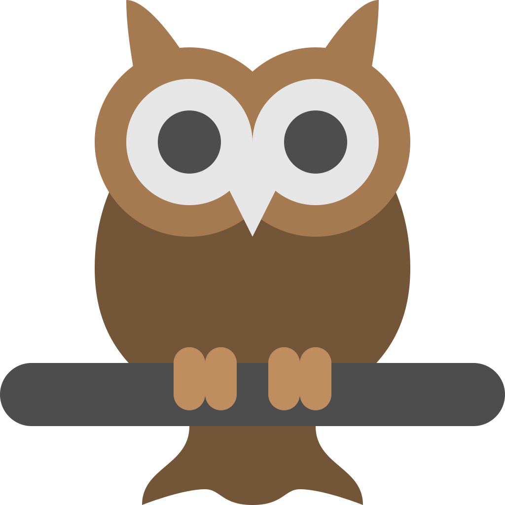

  
  <h3 align="center">Waldkauz</h3>

---

This is a weekend-project to explore multi-arch builds and packaging in go. Waldkauz is small wrapper around the awesome [https://github.com/cloudhut/kowl](Kowl) Kafka client.
With this small wrapper, running kowl is very easy. A single binary providers all required data. Docker is not needed.

## Installation
Just download and start :)

